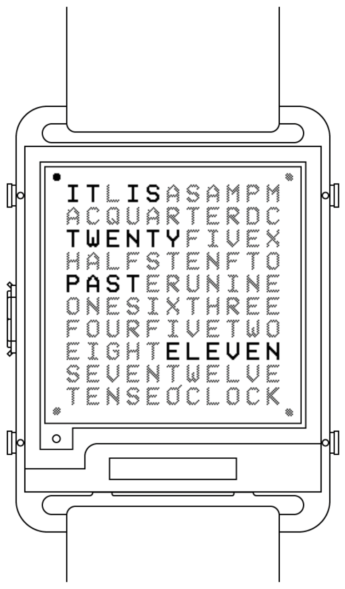

# QLock watchface for Watchy GSR



A port of the [QLock](https://github.com/vtu-dog/qlock) watchface first made by vtu-dog for the original Watchy firmware to [Watchy GSR](https://github.com/gurusr/Watchy_GSR).

## Adding to a Watchy GSR build
1. Add this repo as a submodule in a Watchy GSR repo:
```sh
git submodule add https://github.com/win8linux/WatchyGSR_Addon_QLock.git "Watchface Addons/QLock"
```
2. Add the following include to `src/GSR.ino` in Watchy GSR:
```cpp
#include "../Watchface Addons/QLock/QLock.h"
```
3. Compile!
